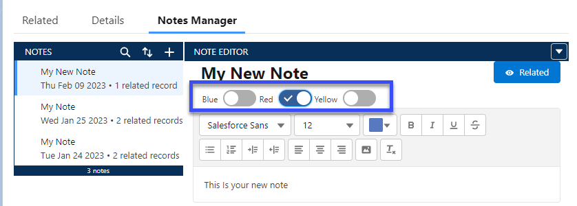
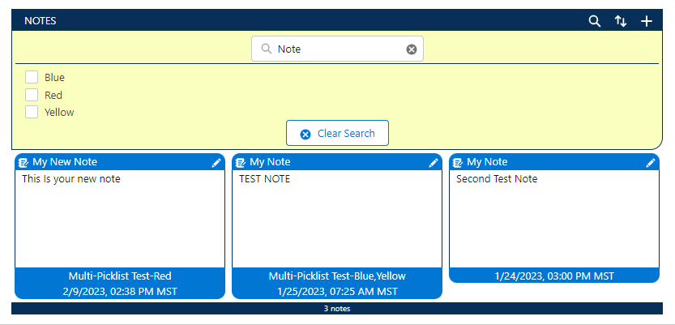
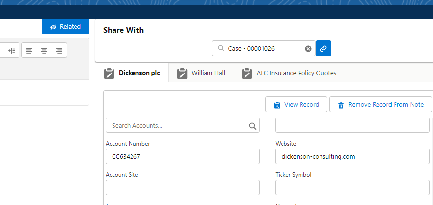
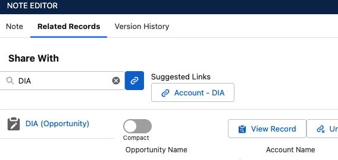
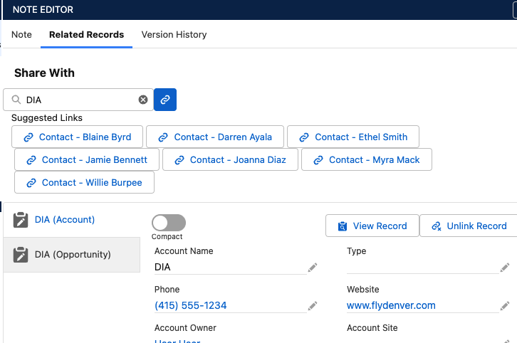
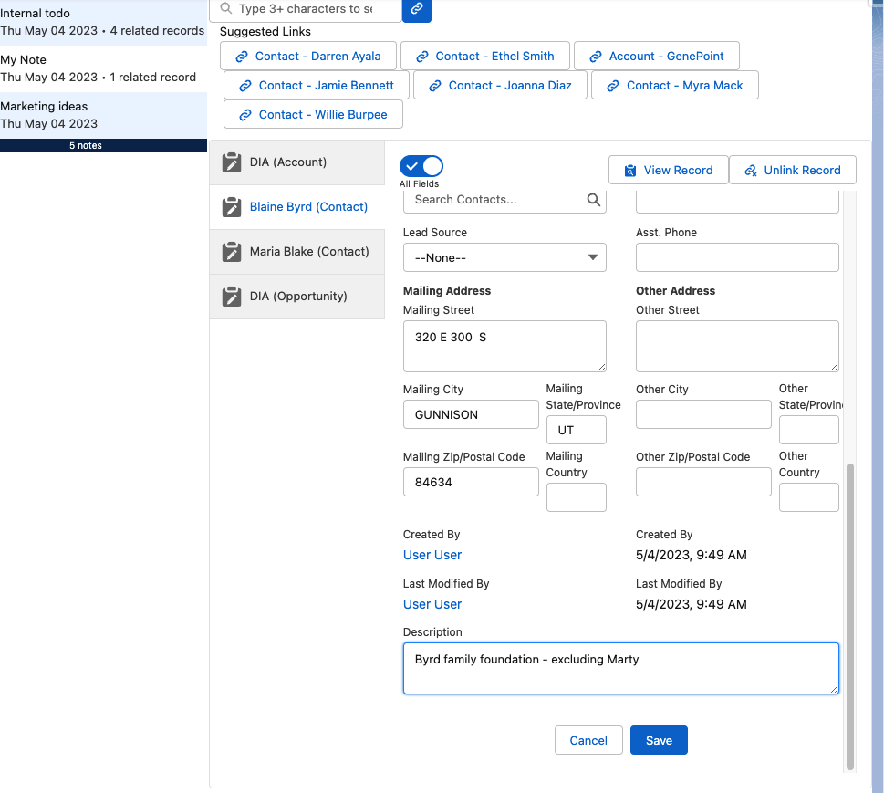
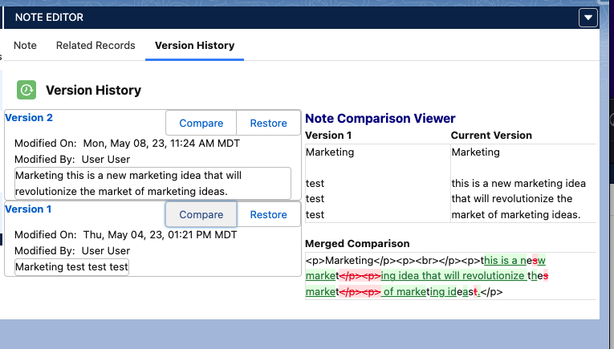

[Back To Home](index.md)

# Features

1. [Tag Your Notes for Easier Searching](#tagging-notes)
1. [Search Salesforce Notes](#search-notes)
1. [Connect Notes with Any Object In Your Org](#create-links-to-records)
1. [Give Users Suggested Links](#suggested-links-to-records)
1. [Edit Linked Records From One Place](#edit-linked-records-from-one-place)
1. [Enhanced Version History](#version-history)

## Tagging Notes

Tag your Notes with helpful information to find them later.

## Search Notes

Search all of you Notes using text, title, or tags.

## Create Links To Records

Link your Notes to any record in you Salesforce org, this enables the same note to appear on multiple records giving scope and visibility to more information, without navigating through tons of windows.

## Suggested Links To Records

Enable your users to quickly add suggested links.

Suggested links look at the currently linked records to the note and gives one click to create relationships.

This note was linked to an opportunity. Via configuration the suggested path of 'AccountId' suggests the Account 'DIA' for the Opportunity 'DIA'.

After the Account 'DIA' is linked to the note, the child contact records are then suggested.

## Edit Linked Records From One Place

Keeps users concentrating on maintaining and entering notes, rather than jumping though multiple screens. Fix or update data all from one place.

## Version History

Do more with the history of the note by quickly comparing versions to see when something was added or removed. Restore information that may have been erroneously deleted or that was ahead of its time.

