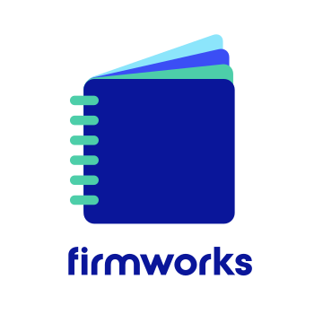

# FirmWorks Notes Salesforce Application

Using Salesforce enhanced notes shouldn't be this way.

FirmWorks Notes is a tool that enables users to quickly tag, search, filter, link, share and curate enhanced notes in Salesforce.

Notes are helpful in capturing information that spans multiple objects and departments. It is very useful to capture implementation details, tone, tactics, and anything else important to support the organization's business.

## FirmWorks Notes

FirmWorks Notes makes it easy to quickly and effectively link the notes so that they appear at multiple levels in object hierarchies for instance the Account, Contact and Opportunity level so that valuable information is visible at multiple levels.

FirmWorks Notes enables organizations to utilize their own taxonomical terms, categories, tags via custom fields. FirmWorks Notes surfaces your own custom fields in a user friendly interface to enable users to work with and manage Salesforce notes however is more intuitive and efficient to themselves.

FirmWorks Notes leverages configurations to curate different tags and experiences to different departments, business units or roles.

Protect your Salesforce investment by unlocking the power of what is already there.

- [Quick Start Guide](quick-start-guide.md)
- [Features](features.md)
- [Release Notes](release-notes.md)

## Visit Us

http://getfirmworks.com

support@getfirmworks.com

