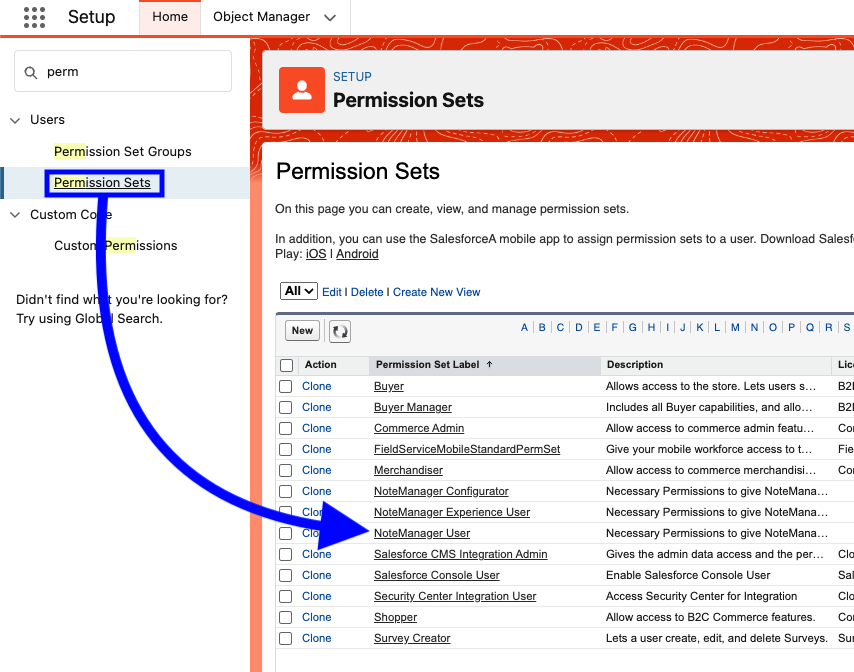
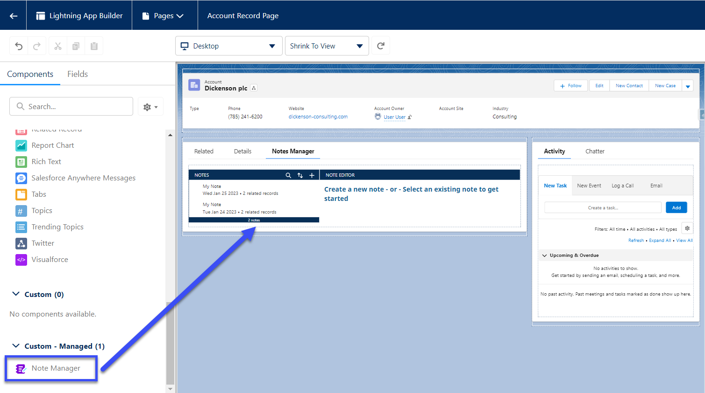
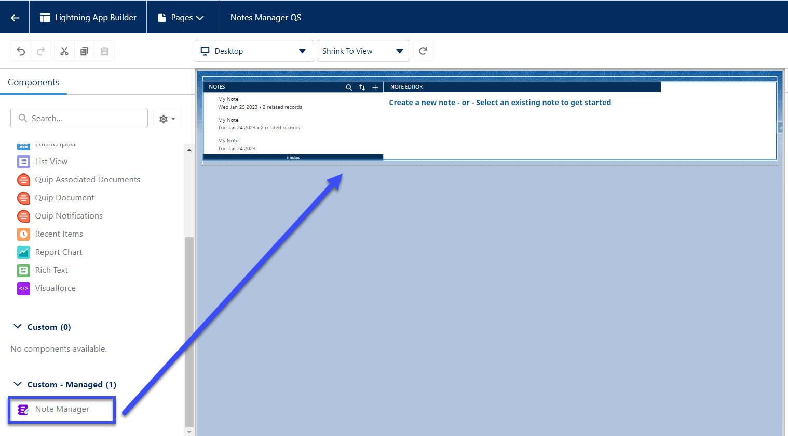
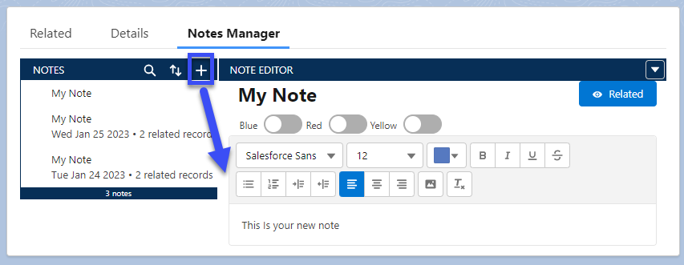
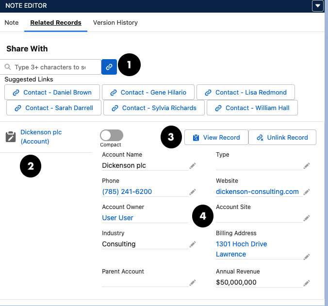
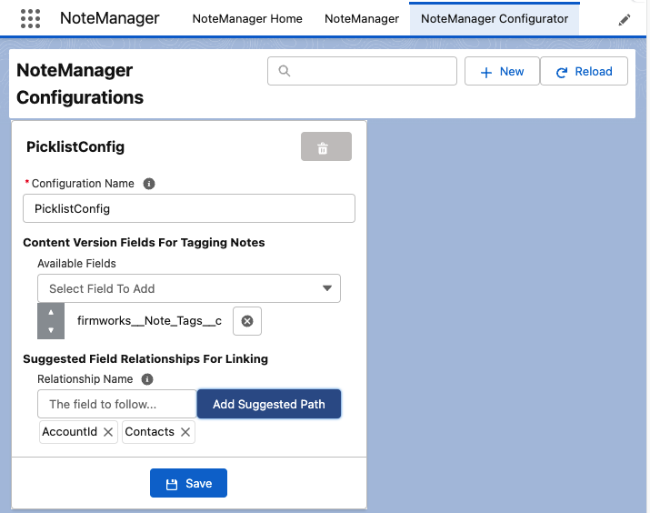
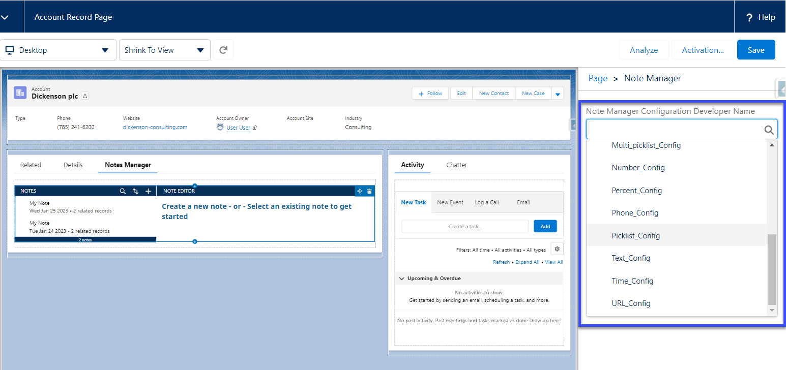

[Back To Home](index.md)

# Quick Start

## Assign FirmWorks Notes Permission Set

You will need to assign the FirmWorks Notes User permission set to any user that needs to view and use the FirmWorks Notes Component

## Add FirmWorks Notes to Lightning App or Lightning Page

### Page Layout

To add the FirmWorks Notes component to a Lighting Page Layout, edit the page the drag the FirmWorks Notes component wherever you want it to display

### Lightning App

To add the FirmWorks Notes component to a Lightning App, you will need to create a new lightning app page in Salesforce Setup. Setup -> Lightning App Builder -> App Page.  At this point you can decide what you want you app page to be called and what it looks likes.

Once it is complete you will need to drag the FirmWorks Notes component onto the page where ever you want to use it.

## Add a Note

To create a new note click the plus button and enter whatever you want. The Note will auto-save when ever you tag or type in the text box.

To edit the note title click the My Note text and type your title.

## Interact with Related Objects

To interact with any object related to the notes you create, click the Related button to show related records.

1. You can use this bar to search for and create new links between you Note and other records in Salesforce.
1. These tabs will show you the names of all the objects currently linked to you note. Click on them to switch between objects.
1. With these two buttons you can View the record in another tab or remove the link to the current record from your note
1. Here you can view and edit the related record. Click cancel to disregard changes or save to commit changes.

## Setup FirmWorks Notes Configuration

If you want to show tags on the component you will need to setup a configuration.

To create a new configuration navigate to customer metadata in Salesforce Setup. Setup -> Custom Metadata Types -> FirmWorks Notes Configuration -> Manage -> New

Choose a label and a Name. then put a comma delimitated list of the Content Version Fields you want to see on the FirmWorks Notes component.

Once you have created a configuration you can reference it wherever you use the FirmWorks Notes Component.

To do this, navigate to a location where you have added the FirmWorks Notes Component and click the FirmWorks Notes Configuration Developer Name to see all of the FirmWorks Notes Configuration you can reference.

